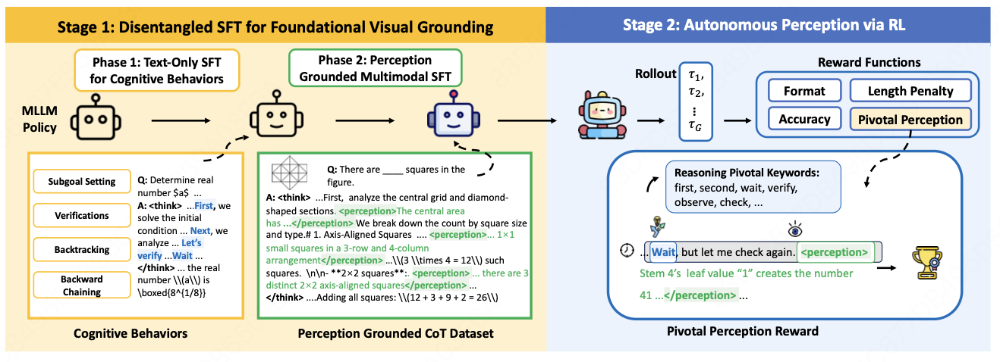

# Learning When to Look: A Disentangled Curriculum for Strategic Perception in Multimodal Reasoning

> **CVPR 2026 Findings Track**

## Overview

Multimodal Large Language Models (MLLMs) suffer from **"visual forgetting"** — as reasoning chains lengthen, models progressively lose visual grounding, a phenomenon described as *"think longer, see less."*

We argue this stems from prematurely **entangling** two distinct cognitive skills during training:
1. **Abstract logical reasoning** ("how-to-think")
2. **Strategic visual perception** ("when-to-look")

We propose a curriculum-based framework to **disentangle** these skills:

- **Stage 1 — Disentangled SFT**: First, text-only SFT builds robust abstract reasoning. Then, Perception-Grounded CoT (PG-CoT) anchors reasoning to visual evidence.
- **Stage 2 — Autonomous Perception via RL**: A novel **Pivotal Perception Reward** teaches the model *when* to look by coupling perceptual actions to linguistic markers of cognitive uncertainty (e.g., "wait," "verify," "check").



## Model & Dataset

Our trained model and RL training dataset are available on HuggingFace:

🤗 **Model**: [zilve/learning-when-to-look](https://huggingface.co/zilve/learning-when-to-look)

🤗 **SFT Stage Dataset**: [zilve/learning-when-to-look-SFTdataset](https://huggingface.co/datasets/zilve/learning-when-to-look-SFTdataset)

## Results

### Multimodal Reasoning Benchmarks (7B Open-Source Models)

| Method | MathVerse-V | MathVision | MathVista | DynaMath-W | WeMath | LogicVista | Avg. |
|--------|:-----------:|:----------:|:---------:|:----------:|:------:|:----------:|:----:|
| Qwen2.5-VL | 42.9 | 25.1 | 68.2 | 21.2 | 36.2 | 45.0 | 39.8 |
| MM-Eureka | 49.6 | 26.9 | 73.0 | 24.0 | 34.7 | 46.8 | 42.5 |
| VL-Rethinker | 49.1 | 32.3 | 74.9 | 27.4 | 27.8 | 44.5 | 42.7 |
| Vision-G1 | 50.0 | 31.3 | 76.1 | 27.2 | 45.1 | 50.2 | 46.7 |
| VAPO-Thinker | 53.3 | 31.9 | 75.6 | — | 43.6 | 50.9 | — |
| Revisual-R1 | 53.6 | 44.7 | 73.1 | 27.5 | 42.0 | 52.3 | 48.9 |
| **Ours** | **53.3** | **44.2** | **73.4** | **30.3** | **54.4** | **49.9** | **50.9** |

Our model achieves **state-of-the-art** on WeMath (+6.0 over prior best) and DynaMath-W, benchmarks that specifically require strategic visual perception.

### Perception Benchmarks

| Method | HallusionBench | MME |
|--------|:--------------:|:---:|
| Qwen2.5-VL | 65.0 | 2180 |
| VL-Rethinker | 69.9 | 2336 |
| ThinkLite-VL | 70.7 | 2378 |
| **Ours** | **68.7** | **2307** |

While maintaining competitive foundational perception, our model dramatically outperforms baselines on high-level reasoning (50.9 avg. vs. 42.7 for VL-Rethinker).

### Ablation: Effect of Disentangled SFT Curriculum

| Method | MathVista | MathVision | WeMath | MathVerse | Avg. |
|--------|:---------:|:----------:|:------:|:---------:|:----:|
| Text-Only SFT | 68.8 | 44.4 | 34.6 | 50.3 | 49.5 |
| Multimodal-Only SFT | 68.6 | 33.3 | 47.3 | 40.0 | 47.3 |
| **Two-Stage (Ours)** | **70.1** | **40.4** | **45.6** | **47.1** | **50.8** |

### Ablation: Effect of Pivotal Perception Reward

| Method | MathVista | MathVision | WeMath | MathVerse | Avg. |
|--------|:---------:|:----------:|:------:|:---------:|:----:|
| Cold Start | 67.8 | 39.9 | 46.2 | 49.1 | 50.8 |
| + RL w/o Perception Reward | 69.9 | 40.2 | 52.8 | 50.7 | 53.4 |
| **+ RL w/ Pivotal Perception Reward** | **73.4** | **44.2** | **53.4** | **53.3** | **56.1** |

## Method

### Stage 1: Disentangled SFT

**Phase 1 — Cognitive Warm-up (Text-Only SFT):**  
Train on high-difficulty text-only reasoning data to acquire abstract logical templates and cognitive behaviors (verification, subgoal setting, backtracking) without visual confounding.

**Phase 2 — Perception-Grounded SFT (PG-CoT):**  
Anchor reasoning to vision via a novel PG-CoT paradigm, where a teacher model inserts fine-grained, step-relevant `<perception>` segments into existing reasoning traces.

Example PG-CoT format:
```
<think>
  ... First, analyze the central grid ...
  <perception>The central area has a 3×4 arrangement of 1×1 squares</perception>
  Let's count by square size ...
  <perception>There are 3 distinct 2×2 axis-aligned squares</perception>
  ...
</think>
```

### Stage 2: RL with Pivotal Perception Reward

The composite reward function:

**R = R_acc + R_pivot + R_form + R_len**

- **R_acc**: Accuracy reward based on ground-truth answer matching
- **R_pivot**: Our novel **Pivotal Perception Reward** — measures whether `<perception>` tags are placed near cognitive uncertainty markers ("wait", "verify", "first", "check", etc.)
- **R_form**: Format reward ensuring correct XML structure
- **R_len**: Length penalty for overly verbose responses

The Pivotal Perception Reward couples perceptual actions to metacognitive signals, structural transitions, and re-examination cues, compelling the model to develop a context-aware perception policy.

## Code

This repository contains the RL training code for Stage 2, built on top of [EasyR1](https://github.com/hiyouga/EasyR1).

Key modifications:
- `verl/utils/entropy_utils.py` — Sentence-level entropy calculation utilities
- `verl/workers/rollout/vllm_rollout_spmd.py` — Modified rollout with logprob extraction
- `verl/workers/reward/function.py` — Extended reward function interface
- `examples/reward_function/perception_reflect_reward.py` — Pivotal Perception Reward implementation
- `examples/config_learning_when_to_look.yaml` — Training configuration

### Setup

```bash
pip install -e .
```

### Training

```bash
python verl/trainer/main.py --config examples/config_learning_when_to_look.yaml
```

```

## Acknowledgements

This project builds upon [EasyR1](https://github.com/hiyouga/EasyR1). We thank the EasyR1 team for their excellent open-source framework.
